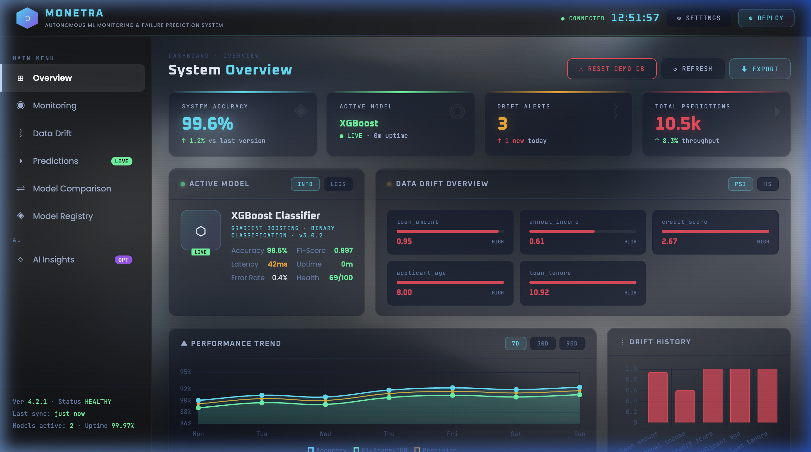

# Monetra: Autonomous ML Model Monitoring & Failure Observability Platform

Monetra is a production-grade model monitoring and observability platform designed to track feature drift, predict classification model failures, dynamically manage active model versions, enforce custom credit risk policies, and generate AI-powered failure analysis reports.

The platform is fully deployed online and integrated with a high-fidelity glassmorphic dashboard.



---

## Live Deployments

*   **Frontend Dashboard (Vercel)**: [https://monetra-self.vercel.app/](https://monetra-self.vercel.app/)
*   **Backend API Service (Render)**: [https://monetra-backend-nngy.onrender.com](https://monetra-backend-nngy.onrender.com) (Health status: [Check Live API Status](https://monetra-backend-nngy.onrender.com))

---

## System Architecture

The Monetra platform consists of two key components:
1.  **FastAPI Python Backend**: A high-performance REST API serving model inferences, calculating distribution drift metrics (Population Stability Index (PSI) & Kolmogorov-Smirnov test), maintaining a persistent SQLite log database, and executing custom model registration.
2.  **Glassmorphic Observability UI**: A responsive Single-Page Application (SPA) built with Vanilla HTML, CSS3, and JavaScript, plotting live statistics with Chart.js, rendering interactive prediction gauges, supporting custom CSV uploads, and managing persistent client-side states in local storage.

```
                  ┌─────────────────────────────────────────┐
                  │               index.html                │
                  │   (Single-Page Observability Dashboard)  │
                  └────┬───────────────────────────────▲────┘
                       │                               │
             POST /predict, /upload-csv      GET /health, /drift, /explain
                       │                               │
                       ▼                               │
   ┌────────────────────────────────────────────────────────┐
   │                 FastAPI Backend Service                │
   │  ┌──────────────────────────────────────────────────┐  │
   │  │                  routes/health.py                 │  │
   │  │  - GET /health (health composition score)        │  │
   │  │  - GET /models (model inventory list)            │  │
   │  │  - POST /models/activate (set active version)     │  │
   │  │  - POST /models/register (upload joblib model)   │  │
   │  └──────────────────────────────────────────────────┘  │
   │  ┌──────────────────────────────────────────────────┐  │
   │  │                  routes/predict.py                │  │
   │  │  - POST /predict (inference & dynamic SHAP)      │  │
   │  └──────────────────────────────────────────────────┘  │
   │  ┌──────────────────────────────────────────────────┐  │
   │  │                  routes/drift.py                  │  │
   │  │  - GET /drift (PSI & Kolmogorov-Smirnov tests)    │  │
   │  └──────────────────────────────────────────────────┘  │
   │  ┌──────────────────────────────────────────────────┐  │
   │  │                  routes/explain.py                │  │
   │  │  - GET /explain (Log RAG context generator)      │  │
   │  └──────────────────────────────────────────────────┘  │
   └───────────┬─────────────────────────────────┬──────────┘
               │                                 │
               ▼                                 ▼
    ┌────────────────────┐            ┌────────────────────┐
    │     monetra.db     │            │     ml_models/     │
    │  (SQLite Log DB)   │            │ (pkl/joblib files) │
    └────────────────────┘            └────────────────────┘
```

---

## Core Observability Features

*   **Logic-Based Risk Retraining**: Addressed historical dataset biases (where models approved loans solely on CIBIL score) by implementing a logic-based data preprocessing layer with strict underwriting knockout rules (CIBIL < 500, Loan-to-Income ratio > 6x, asset backing < 25%).
*   **Dynamic Custom Model Support**: Restructured the prediction pipeline to dynamically locate classifier steps and extract feature weights (`coef_` or `feature_importances_`) for custom-registered pipelines on the fly, eliminating `500` shape mismatches.
*   **Production Telemetry & Drift Analysis**: Evaluates live prediction logs against baseline training distributions to measure features for statistical drift (PSI and KS test) and updates a composite health index score in real-time.
*   **Interactive Settings Modal**: Hot-swaps the backend connection URL, adjusts drift warning/critical limits, and manages OpenAI API keys. Local storage caches settings to persist configurations across browser reloads with automatic migration.
*   **Interactive Exports**: Fully implemented report downloading buttons for both **Model comparison (Report)** (detailing registered model stats) and **Comparison (Health report)** (detailing overview metrics and drift parameters).
*   **Alert Integrations**: Features optional Slack Webhook integrations to push automated notices if composite model health drops below target thresholds.

---

## Underwriting Risk Policy Rules (Retrained Models)
To resolve predictive bias, models were retrained under logical credit risk assumptions enforced in [train_models.py](monetra-backend-FIXED/train_models.py):
*   **CIBIL Knockout**: Automatically reject loan if CIBIL score is `< 500`.
*   **Loan-to-Income (LTI) limit**: Automatically reject loan if requested loan amount is `> 6x` the applicant's annual income.
*   **Asset Coverage**: Reject loan if total assets (residential + luxury + bank assets) are `< 25%` of the loan amount, unless the CIBIL score is outstanding (`>= 750`).

---

## Setup & Local Installation

### 1. Set Up the Python Backend
Navigate to the backend folder, create a virtual environment, and install dependencies:
```bash
cd monetra-backend-FIXED
python3 -m venv .venv
source .venv/bin/activate
pip install -r requirements.txt
```

### 2. Train Models & Generate Datasets
Retrain the model suite (Lasso, Random Forest, XGBoost/GBM) and initialize baseline feature statistics:
```bash
python train_models.py --data ../loan_approval_10000.csv
```
Generate the demo drift dataset containing customer population shifts (e.g. higher loan requests, lower credit ratings):
```bash
python generate_drift_data.py
```
This generates `loan_approval_high_drift_demo.csv` at the root folder for upload testing.

### 3. Run FastAPI Locally
Start the server in reload mode:
```bash
uvicorn main:app --reload --host 0.0.0.0 --port 8000
```
*   Local endpoint will be available at: `http://127.0.0.1:8000`
*   Open [index.html](index.html) directly in any browser to access the dashboard locally.

---

## API Endpoint Documentation

| Route | Method | Description |
| :--- | :--- | :--- |
| `/health` | `GET` | Returns composite health score, error rates, failure probability, and latency stats. |
| `/models` | `GET` | Returns list of all registered models (name, version, framework, features, accuracy). |
| `/models/activate` | `POST` | Activates a registered model version for live prediction processing. |
| `/models/register` | `POST` | Dynamically uploads and registers a new `.pkl` or `.joblib` model binary. |
| `/predict` | `POST` | Runs inference on an applicant vector, logs metrics to SQLite, and returns SHAP attributions. |
| `/upload-csv` | `POST` | Uploads a CSV dataset to process bulk predictions and evaluate current distribution drift. |
| `/drift` | `GET` | Compares recent logs against baseline statistics to compute PSI and Kolmogorov-Smirnov metrics. |
| `/explain` | `GET` | Evaluates system logs to output RAG context logs and text failure explanations. |
| `/database/reset` | `POST` | Wipes the SQLite log history and seeds 100 baseline records. |

---

## Deployment & Hosting

### Frontend (GitHub Pages)
The static frontend is hosted on Vercel. Any push to the `main` branch of [ihsuk/Monetra](https://github.com/ihsuk/Monetra) automatically compiles and deploys the update.

### Backend (Render)
The backend is deployed as a manual **Web Service** on Render using:
*   **Environment**: Python
*   **Root Directory**: `monetra-backend-FIXED`
*   **Build Command**: `pip install -r requirements.txt`
*   **Start Command**: `uvicorn main:app --host 0.0.0.0 --port $PORT`
*   **Environment Variables**: `PYTHON_VERSION=3.11.9` *(required to resolve pre-compiled binary wheel support)*
*   **Blueprints**: A [render.yaml](render.yaml) file is included at the root level to allow automatic blueprint deployment when payment information is configured.
